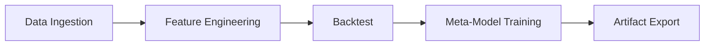

# Phiradon168
[](https://github.com/nicetpad2/Phiradon168/actions) [](https://codecov.io/gh/nicetpad2/Phiradon168) [](https://pypi.org/project/phiradon168/)

## Overview
ระบบ NICEGOLD Enterprise ใช้เทรดและวิเคราะห์ XAUUSD บนกรอบเวลา M1 รองรับทั้งการทดสอบย้อนหลังและ Walk-Forward Validation

## Prerequisites
- Python 3.8-3.10
- ติดตั้งไลบรารีด้วย `pip install -r requirements.txt`
- กำหนดตัวแปรสภาพแวดล้อมผ่านไฟล์ `.env` (ดูตัวอย่าง `.env.example`)

## Installation
```bash
git clone <repo-url>
cd Phiradon168
pip install -r requirements.txt
```

## Usage
```bash
python main.py --mode backtest
python ProjectP.py --mode all
```

## Project Structure
- src/: โค้ดหลักและโมดูลต่าง ๆ
- config/: ไฟล์ตั้งค่า (`pipeline.yaml`)
- tuning/: สคริปต์หาค่า hyperparameter
- tests/: ชุดทดสอบอัตโนมัติ
- docs/: เอกสารประกอบ
- logs/<date>/<fold>/: log แยกตามวันที่และ fold

## Contribution Guidelines
- ชื่อ branch: `feature/<desc>` หรือ `hotfix/<issue>`
- commit message รูปแบบ `[Patch vX.Y.Z] <ข้อความสั้น>`
- รัน `pytest -q` และจัดรูปแบบโค้ดด้วย PEP8/Black

### คำแนะนำการติดตั้งเพิ่มเติม
1. สร้าง virtualenv และติดตั้งไลบรารีหลัก:
   ```bash
   pip install -r requirements.txt
   ```
### Dependencies
- Python 3.8-3.10
- pandas>=2.2.2
- numpy>=2.0
- scikit-learn>=1.6.1
- catboost>=1.2.8

2. หากต้องการให้โปรแกรมติดตั้งไลบรารีอัตโนมัติเมื่อไม่พบ ให้ตั้งค่า `AUTO_INSTALL_LIBS=True` ใน `src/config.py`.
    ค่าเริ่มต้นคือ `True` ช่วยให้ระบบติดตั้งไลบรารีที่ขาดหายได้อัตโนมัติ แต่หากต้องการปิดการติดตั้งเองให้เปลี่ยนเป็น `False`
    และหาก `AUTO_INSTALL_LIBS=False` แล้วไม่พบไลบรารีสำคัญ (CatBoost, Optuna, SHAP)
## โครงสร้างโฟลเดอร์
- `src/` โค้ดหลักและโมดูลต่าง ๆ
- `config/` ไฟล์ตั้งค่าระบบ (`pipeline.yaml`)
- `tuning/` สคริปต์ค้นหา Hyperparameter
- `tests/` ชุดทดสอบอัตโนมัติ
- `docs/` เอกสารประกอบ
- `logs/<date>/<fold>/` โฟลเดอร์บันทึก log แยกตามวันที่และ fold

## การใช้งานสคริปต์หลัก
- `python ProjectP.py` เตรียมข้อมูลพื้นฐานและรันขั้นตอนหลัก
- `python tuning/hyperparameter_sweep.py` รันฝึกโมเดลหลายค่าพารามิเตอร์
- `python threshold_optimization.py` หา threshold ที่ดีที่สุดด้วย Optuna
- `python main.py --stage backtest` รัน backtest พร้อม config ใน `config/pipeline.yaml`
- `python main.py --stage all` ทำ Walk-Forward Validation ทั้งชุด
- `python profile_backtest.py <CSV>` วิเคราะห์คอขวดประสิทธิภาพ
## การตั้งค่า config.yaml
ไฟล์ `config/pipeline.yaml` ใช้กำหนดค่าพื้นฐานของ pipeline เช่นระดับ log และโฟลเดอร์โมเดล
ตัวอย่างค่าเริ่มต้น:
```yaml
log_level: INFO
model_dir: models
threshold_file: threshold_wfv_optuna_results.csv
```


### การปรับค่า Drift Threshold
หากต้องการปรับเกณฑ์การแจ้งเตือน Drift สำหรับฟีเจอร์ เช่น ADX
สามารถกำหนดตัวแปรสภาพแวดล้อม `DRIFT_WASSERSTEIN_THRESHOLD` (ค่าปกติ `0.1`)
ก่อนรันโปรแกรมได้ เช่น
```bash
export DRIFT_WASSERSTEIN_THRESHOLD=0.2
python ProjectP.py
```


## การวัดประสิทธิภาพ
ใช้ `profile_backtest.py` เพื่อวัด bottleneck ของฟังก์ชันจำลองการเทรด
ตัวอย่างการรัน:
```bash
python profile_backtest.py XAUUSD_M1.csv --rows 10000 --limit 30 --output profile.txt --output-file backtest.prof
```
คำสั่งด้านบนจะแสดง 30 ฟังก์ชันที่ใช้เวลามากที่สุดตามค่า `cumtime` จาก `cProfile` และบันทึกผลไว้ใน `profile.txt` รวมทั้งไฟล์ `backtest.prof` สำหรับเปิดใน SnakeViz.
หากต้องการเก็บไฟล์ profiling แยกตามแต่ละรอบ ให้ระบุโฟลเดอร์ผ่าน `--output-profile-dir` ดังนี้:
```bash
python profile_backtest.py XAUUSD_M1.csv --output-profile-dir profiles
```
นอกจากนี้ยังสามารถระบุชื่อ Fund Profile และสั่งให้ฝึกโมเดลหลังจบการทดสอบได้ดังนี้:
```bash
python profile_backtest.py XAUUSD_M1.csv --fund AGGRESSIVE --train --train-output models
```

## การลดข้อความ Log
หากต้องการให้โปรแกรมแสดงเฉพาะคำเตือนและสรุปผลแบบย่อ สามารถตั้งค่า
ตัวแปรสภาพแวดล้อม `COMPACT_LOG=1` ก่อนรัน `ProjectP.py` เช่น

```bash
COMPACT_LOG=1 python ProjectP.py
```
ค่าดังกล่าวจะปรับระดับ log เป็น `WARNING` อัตโนมัติ ทำให้เห็นเฉพาะ
ข้อความสำคัญและผลลัพธ์สรุปท้ายรัน

### การรันชุดทดสอบ
ใช้สคริปต์ `run_tests.py` เพื่อรัน `pytest` โดยเปิดโหมด COMPACT_LOG อัตโนมัติ

```bash
python run_tests.py
```
ผลลัพธ์จะแสดงเฉพาะคำเตือนและสรุปจำนวนการทดสอบทั้งหมด

## การปรับค่า Drift Override
สามารถกำหนดระดับ Drift ที่จะปิดการใช้คะแนน RSI ได้ที่ตัวแปร
`RSI_DRIFT_OVERRIDE_THRESHOLD` ในไฟล์ `src/config.py` (ค่าเริ่มต้น 0.65)
หาก Drift ของ RSI สูงเกินค่านี้ ระบบจะไม่ใช้เงื่อนไข RSI ในการคำนวณสัญญาณ

## การจัดการ Drift และการ Re-training
หากตรวจพบว่าฟีเจอร์บางรายการมีค่า Wasserstein distance สูงกว่า `0.15`
สามารถใช้เมธอด `DriftObserver.needs_retrain` ตรวจสอบว่า fold ใดควรฝึกโมเดลใหม่
พร้อมทั้งพิจารณาปรับขั้นตอน normalize/standardize ของอินดิเคเตอร์
เพื่อให้รองรับการกระจายตัวของข้อมูลที่เปลี่ยนไป
กรณี Drift รุนแรงจนโมเดลเดิมใช้งานไม่ได้ อาจรวบรวมข้อมูลตลาดช่วงทดสอบ
หรือสร้างข้อมูลเพิ่ม (Data Augmentation) เพื่อลดผลกระทบจาก Drift

## หมายเหตุการใช้งาน
* ฟังก์ชัน `safe_set_datetime` ภายใน `data_loader.py` ช่วยแก้ปัญหา
  `FutureWarning` เมื่อต้องตั้งค่า datetime ใน DataFrame
* ฟังก์ชัน `setup_fonts` ถูกออกแบบมาสำหรับ Google Colab เพื่อให้กราฟแสดงฟอนต์ไทยได้ถูกต้อง
  หากใช้งานบน VPS อาจไม่จำเป็น และบางครั้งอาจทำให้เกิด error จากการติดตั้งฟอนต์
* ไฟล์ QA summary (`qa_summary_<label>.log`) และไฟล์แจ้งเตือนกรณีไม่มีข้อมูล (`<label>_trade_qa.log`)
  จะถูกเก็บไว้ภายใน `output_default/qa_logs/` โดยสามารถสร้างโฟลเดอร์ย่อยตามชื่อกองทุน
  เช่น `output_default/qa_logs/FUND_A/` เพื่อแยกข้อมูล QA ของแต่ละกองทุนอย่างเป็นระเบียบ
* หากต้องประมวลผลอินดิเคเตอร์หลายชุดบนข้อมูลขนาดใหญ่ ควรใช้
  `load_data_cached()` เพื่อบันทึกผลลัพธ์ในรูปแบบ Parquet/Feather
  และสามารถบันทึก DataFrame ที่สร้างฟีเจอร์แล้วเป็นไฟล์ HDF5 ผ่าน
  `save_features_hdf5()` เพื่อให้โหลดซ้ำได้เร็วขึ้น
* ฟังก์ชันใหม่ `add_momentum_features()` และ `calculate_cumulative_delta_price()`
  ช่วยสร้างฟีเจอร์ Momentum/Delta สำหรับฝึก MetaModel
* ใช้ `merge_wave_pattern_labels()` เมื่อต้องการเพิ่มป้ายกำกับแพตเทิร์นจาก
  ไฟล์บันทึกของ Wave_Marker_Unit
## การรันบน Colab และ VPS
ระบบจะตรวจสอบโดยอัตโนมัติว่ารันบน Google Colab หรือไม่ผ่านฟังก์ชัน `is_colab()` ใน `src/config.py`
- หากเป็น Colab จะทำการ mount Google Drive และติดตั้งฟอนต์ให้เอง สามารถรัน `python ProjectP.py` หรือ `python main.py --stage all` ได้ทันที
- หากรันบน VPS ไม่จำเป็นต้อง mount Drive และสามารถกำหนดเส้นทางด้วยตัวแปร `FILE_BASE_OVERRIDE` เพื่อชี้ไปยังโฟลเดอร์ข้อมูล


## ภาพรวมกระบวนการทำงาน
เพื่อให้เห็นขั้นตอนหลักของระบบได้ชัดเจนยิ่งขึ้น สามารถอ้างอิงแผนภาพ
Mermaid ด้านล่างซึ่งสรุปการไหลของข้อมูลตั้งแต่การรับข้อมูลดิบไปจนถึงการส่งออกโมเดล



แผนภาพข้างต้นช่วยให้ทีมมองเห็นภาพรวมของกระบวนการได้รวดเร็ว ไม่ว่าจะเป็นการเตรียมข้อมูล
การสร้างฟีเจอร์ การทดสอบย้อนกลับ ไปจนถึงการฝึกเมตาโมเดลและการนำผลลัพธ์ไปใช้งาน

### การวิเคราะห์ Trade Logs
เครื่องมือ `src/log_analysis.py` ช่วยสรุปผลการเทรดจากไฟล์ `logs` ไม่ว่าจะเป็นช่วงเวลาที่ได้กำไรมากที่สุด อัตราการชนะต่อชั่วโมง สาเหตุการปิดออเดอร์ ระยะเวลาถือครอง และสถิติ drawdown
ตัวอย่างการใช้งาน:
```python
from src.log_analysis import (
    parse_trade_logs,
    calculate_hourly_summary,
    calculate_reason_summary,
    calculate_duration_stats,
    calculate_drawdown_stats,
    parse_alerts,
    calculate_alert_summary,
    export_summary_to_csv,
    plot_summary,
)

logs_df = parse_trade_logs('logs/2025-06-05/fold1/gold_ai_v5.8.2_qa.log')
summary = calculate_hourly_summary(logs_df)
print(summary)
reason_stats = calculate_reason_summary(logs_df)
duration = calculate_duration_stats(logs_df)
drawdown = calculate_drawdown_stats(logs_df)
alerts = calculate_alert_summary('logs/2025-06-05/fold1/gold_ai_v5.8.2_qa.log')
export_summary_to_csv(summary.reset_index(), 'summary.csv.gz')
fig = plot_summary(summary)
fig.savefig('summary.png')
```
ฟังก์ชัน `calculate_position_size` ยังช่วยคำนวณขนาดลอตที่เหมาะสมตามทุนและระยะ SL

Updated for patch 5.7.3.

Patch 5.7.8 resolves font configuration parsing errors when plotting.

