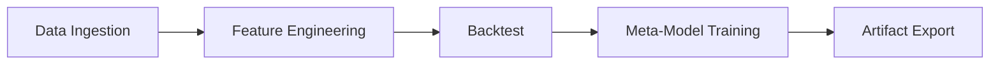

# Phiradon168

คำแนะนำการติดตั้ง
-------------------
1. สร้าง virtualenv และติดตั้งไลบรารีหลัก:
   ```bash
   pip install -r requirements.txt
   ```
2. หากต้องการให้โปรแกรมติดตั้งไลบรารีอัตโนมัติเมื่อไม่พบ ให้ตั้งค่า `AUTO_INSTALL_LIBS=True` ใน `src/config.py`.
    ค่าเริ่มต้นคือ `False` เพื่อป้องกันการติดตั้งบนระบบที่ไม่มีสิทธิ์หรือไม่มีอินเทอร์เน็ต
    และหาก `AUTO_INSTALL_LIBS=False` แล้วไม่พบไลบรารีสำคัญ (CatBoost, Optuna, SHAP)
    ระบบจะขึ้นคำเตือนและข้ามขั้นตอนที่เกี่ยวข้องโดยอัตโนมัติ ไม่ถือว่าเป็นข้อผิดพลาดร้ายแรง

## การวัดประสิทธิภาพ
ใช้ `profile_backtest.py` เพื่อวัด bottleneck ของฟังก์ชันจำลองการเทรด
ตัวอย่างการรัน:
```bash
python profile_backtest.py XAUUSD_M1.csv --rows 10000 --limit 30 --output profile.txt
```
คำสั่งด้านบนจะแสดง 30 ฟังก์ชันที่ใช้เวลามากที่สุดตามค่า `cumtime` จาก `cProfile` และบันทึกผลไว้ใน `profile.txt`.
นอกจากนี้ยังสามารถระบุชื่อ Fund Profile และสั่งให้ฝึกโมเดลหลังจบการทดสอบได้ดังนี้:
```bash
python profile_backtest.py XAUUSD_M1.csv --fund AGGRESSIVE --train --train-output models
```

## การลดข้อความ Log
หากต้องการให้โปรแกรมแสดงเฉพาะคำเตือนและสรุปผลแบบย่อ สามารถตั้งค่า
ตัวแปรสภาพแวดล้อม `COMPACT_LOG=1` ก่อนรัน `ProjectP.py` เช่น

```bash
COMPACT_LOG=1 python ProjectP.py
```
ค่าดังกล่าวจะปรับระดับ log เป็น `WARNING` อัตโนมัติ ทำให้เห็นเฉพาะ
ข้อความสำคัญและผลลัพธ์สรุปท้ายรัน

## หมายเหตุการใช้งาน
* ฟังก์ชัน `safe_set_datetime` ภายใน `data_loader.py` ช่วยแก้ปัญหา
  `FutureWarning` เมื่อต้องตั้งค่า datetime ใน DataFrame
* ฟังก์ชัน `setup_fonts` ถูกออกแบบมาสำหรับ Google Colab เพื่อให้กราฟแสดงฟอนต์ไทยได้ถูกต้อง
  หากใช้งานบน VPS อาจไม่จำเป็น และบางครั้งอาจทำให้เกิด error จากการติดตั้งฟอนต์

## ภาพรวมกระบวนการทำงาน
เพื่อให้เห็นขั้นตอนหลักของระบบได้ชัดเจนยิ่งขึ้น สามารถอ้างอิงแผนภาพ
Mermaid ด้านล่างซึ่งสรุปการไหลของข้อมูลตั้งแต่การรับข้อมูลดิบไปจนถึงการส่งออกโมเดล



แผนภาพข้างต้นช่วยให้ทีมมองเห็นภาพรวมของกระบวนการได้รวดเร็ว ไม่ว่าจะเป็นการเตรียมข้อมูล
การสร้างฟีเจอร์ การทดสอบย้อนกลับ ไปจนถึงการฝึกเมตาโมเดลและการนำผลลัพธ์ไปใช้งาน
