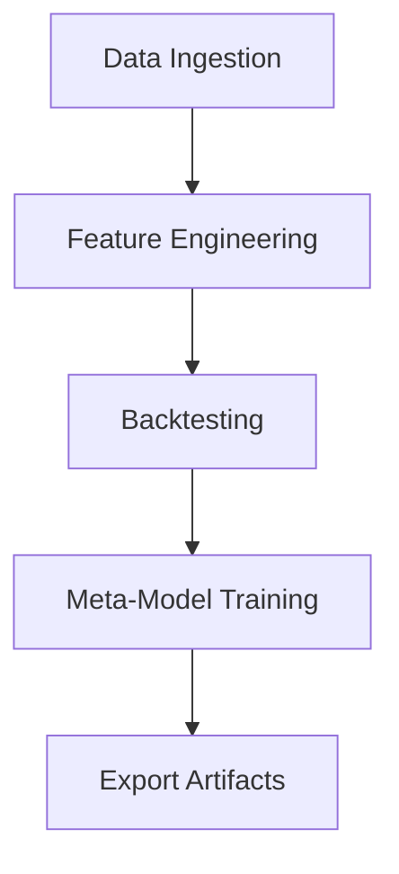

# Documentation

ไฟล์นี้สรุปขั้นตอนการติดตั้งและการใช้งานระบบอย่างย่อ พร้อมแผนภาพ Flowchart เพื่อตอกย้ำลำดับขั้นตอนหลัก

## การติดตั้ง
1. สร้าง Virtualenv และติดตั้งไลบรารี:
   ```bash
   pip install -r requirements.txt
   ```
2. หากต้องการติดตั้งไลบรารีโดยอัตโนมัติทุกครั้ง สามารถตั้งค่า `AUTO_INSTALL_LIBS=True` ภายใน `src/config.py`

## การรัน Pipeline
ใช้งานผ่านสคริปต์หลัก `ProjectP.py` หรือใช้ `profile_backtest.py` เพื่อประเมินประสิทธิภาพ ตัวอย่างเช่น
```bash
python profile_backtest.py XAUUSD_M1.csv --rows 1000 --console_level WARNING
```

## โครงสร้างโฟลเดอร์
- `src/` โค้ดหลักของระบบ
- `tuning/` โมดูลสำหรับการหา Hyperparameter
- `logs/` ไฟล์บันทึกผลการรันและ QA ต่าง ๆ

## Flowchart

