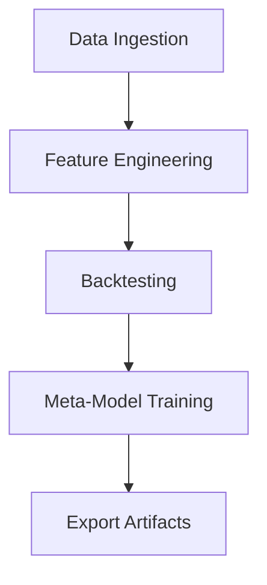

# Documentation

ไฟล์นี้สรุปขั้นตอนการติดตั้งและการใช้งานระบบอย่างย่อ พร้อมแผนภาพ Flowchart เพื่อตอกย้ำลำดับขั้นตอนหลัก

## การติดตั้ง
1. สร้าง Virtualenv และติดตั้งไลบรารี:
   ```bash
   pip install -r requirements.txt
   ```
2. หากต้องการติดตั้งไลบรารีอัตโนมัติในช่วงพัฒนา ให้ตั้งค่า `AUTO_INSTALL_LIBS=True` ภายใน `src/config.py`
   ค่าเริ่มต้นถูกตั้งเป็น `False` เพื่อความปลอดภัย ควรติดตั้งไลบรารีผ่าน `pip install -r requirements.txt` ก่อนใช้งานจริง

## การรัน Pipeline
ใช้งานผ่านสคริปต์หลัก `ProjectP.py` หรือใช้ `profile_backtest.py` เพื่อประเมินประสิทธิภาพ ตัวอย่างเช่น
```bash
python profile_backtest.py XAUUSD_M1.csv --console_level WARNING
```
สำหรับการทดสอบรวดเร็ว สามารถระบุ `--debug` เพื่อลดจำนวนแถวที่โหลด
```bash
python profile_backtest.py XAUUSD_M1.csv --debug
```

## โครงสร้างโฟลเดอร์
- `src/` โค้ดหลักของระบบ
- `tuning/` โมดูลสำหรับการหา Hyperparameter
- `docs/data_cleaner/README.md` คำอธิบายสคริปต์ทำความสะอาดข้อมูล
- `docs/holdout_oos.md` คู่มือการแบ่งข้อมูลแบบ Hold-Out OOS

- `logs/<date>/<fold>/` ไฟล์บันทึกผลการรันแยกตามวันที่และ fold

## การใช้งานสคริปต์
- `python ProjectP.py` เตรียมข้อมูลและเรียก pipeline หลัก
- `python tuning/hyperparameter_sweep.py` ทดสอบค่า hyperparameter
- ก่อนรัน sweep ต้องทำ Walk-Forward Validation ให้สร้างไฟล์ `logs/trade_log_<DATE>.csv` ให้เรียบร้อย
- `python main.py --stage backtest` รัน backtest ตามค่าใน `config/pipeline.yaml`
- `python profile_backtest.py <CSV>` ตรวจสอบ bottleneck
- ระบบมีตัวกรองความผันผวน (Volatility Filter) ไม่เปิดออร์เดอร์หากค่า `Volatility_Index` ต่ำกว่า 1.0


## Flowchart


## การสรุป Metrics หลัง Sweep
หลังจากจบการรัน `tuning/hyperparameter_sweep.py` ให้นำผล AUC/K-Fold จากทุกรอบมาเก็บในไฟล์ `metrics_summary.csv` และแสดงคอนฟิกอันดับสูงสุด 5 รายการบนหน้าจอ
