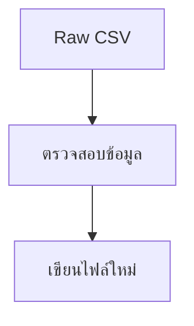

# data_cleaner
สคริปต์สำหรับตรวจสอบและลบแถวซ้ำจากไฟล์ CSV ก่อนเข้าสู่ pipeline หลัก

```bash
python src/data_cleaner.py <input.csv> --output cleaned.csv
```


```mermaid
flowchart TD
    A[Raw CSV] --> B[ตรวจสอบข้อมูล]
    B --> C[เขียนไฟล์ใหม่]
```
